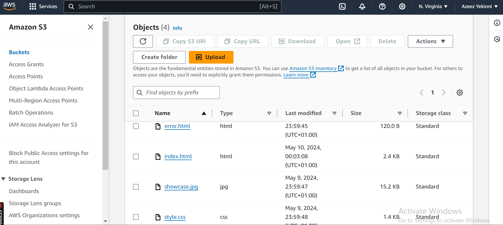
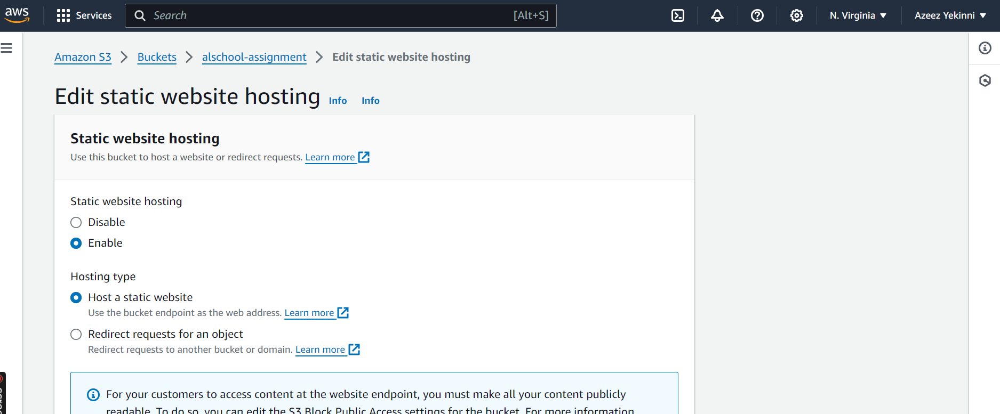
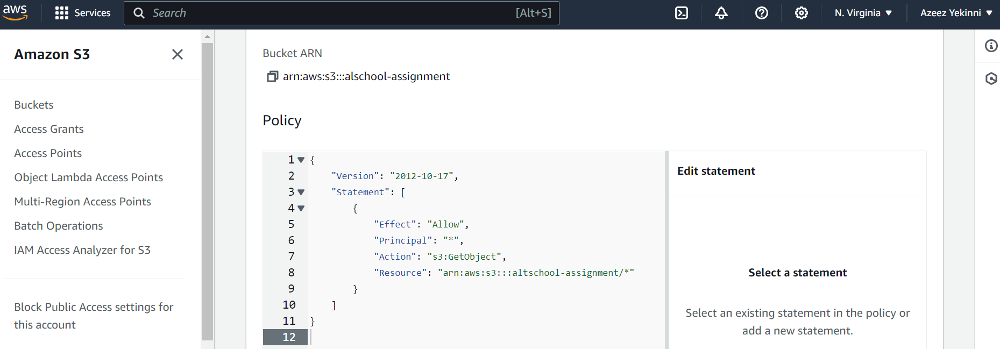
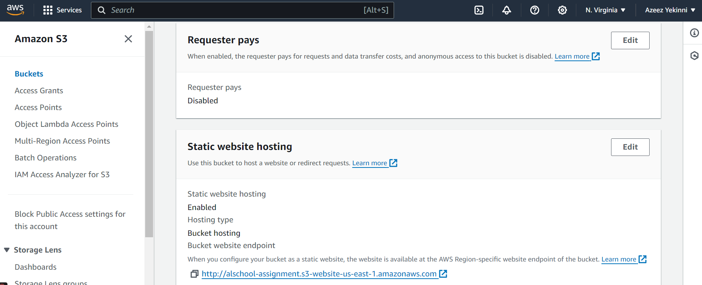
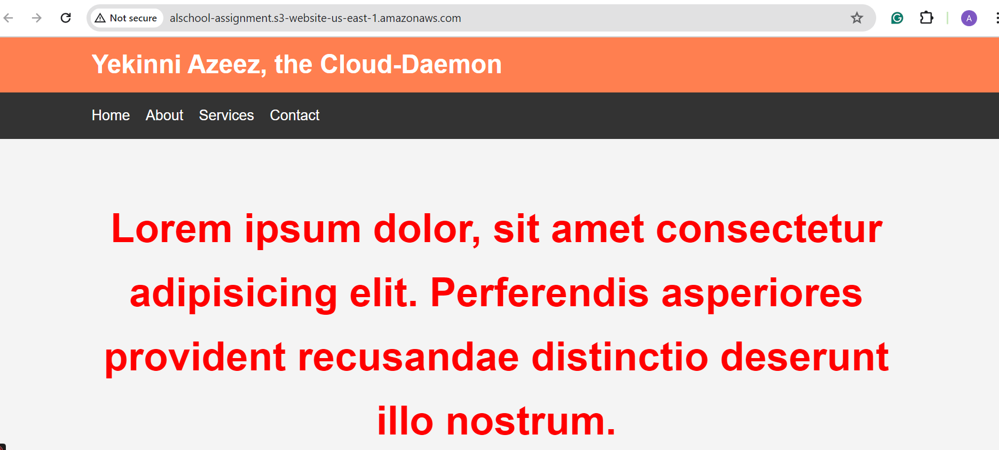
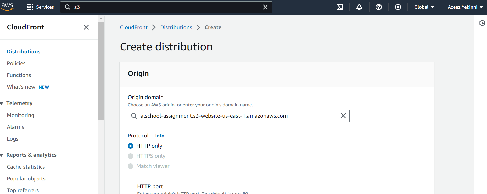
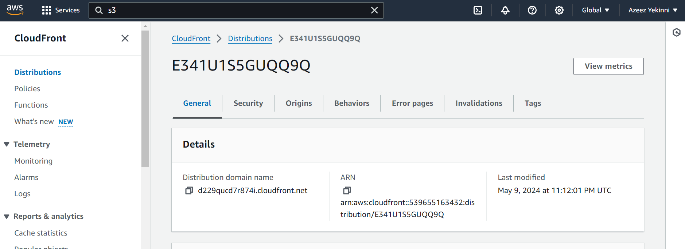
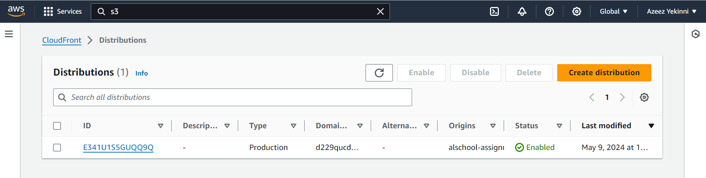
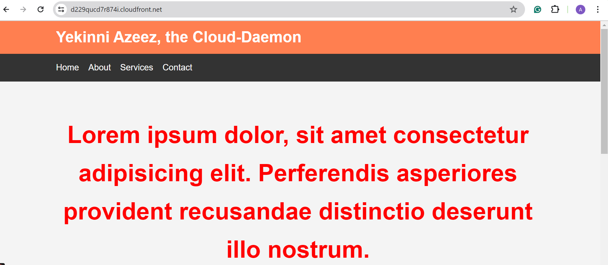

# static-website

# In this simple project, I deployed a static website with AWS S3 using ClouFront as the CDN

## Here are the steps i took to achieving this

## STEP 1: Configuring the S3 bucket

I logged into my AWS account as the root user.

I created an s3 bucket and uploaded my static website files

I then configured my s3 bucket to enable static website hosting and other necessary configurations like specifying the index document

The bucket policy was added.

After successfuly doing the above, I was able to access my website through the Amazon S3 endpoint on the internet

* ## End-point URL

* ## My Website

## STEP 2: Configuring the CloudFront Distribution

I createdand configured a CloudFront distribution using the static S3 end-point URL

The distribution was created and my website deployed and assigned a distribution domain name

The distributions is now enabled

I can now access my website through the distribution domain name assignes to my cloudfront distribution

> # THANK YOU
> *yekinni azeez, the Cloud-Daemon*